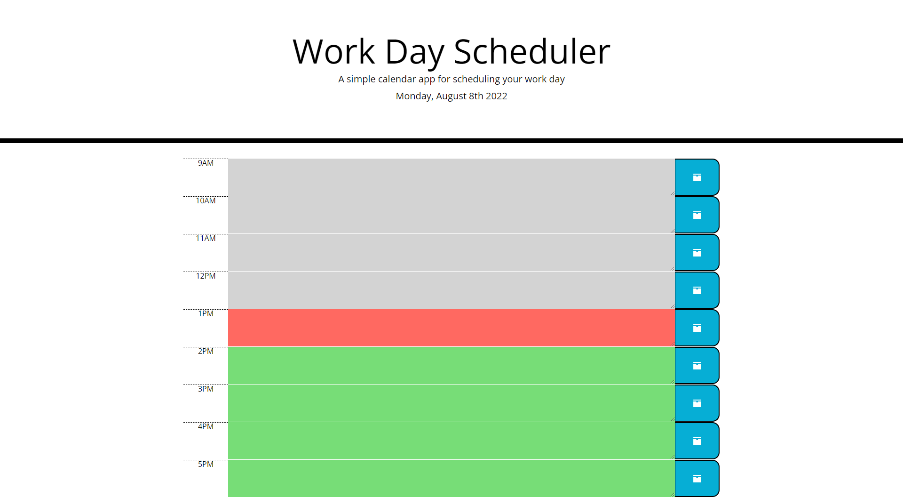
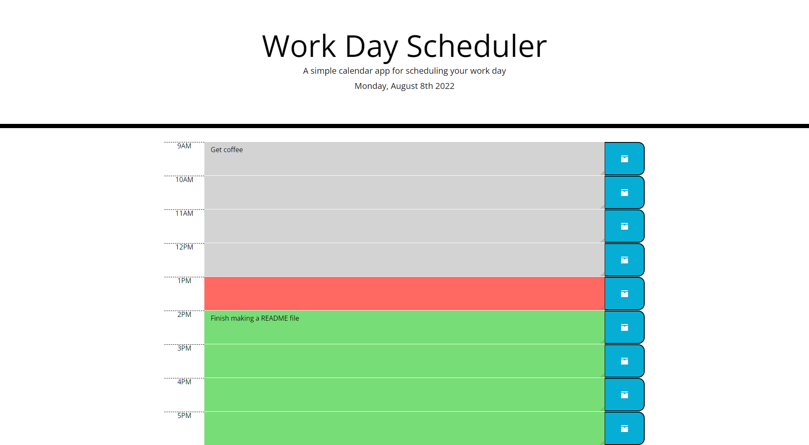

# Work Day Scheduler Starter

## Description
The purspose of this application is to demonstrate proficiency in the use of third party libraries. In this porject jQuery and Moment.js were used. Moment.js was used to manipulate dates and time while jQuery was used to manipulate the DOM elements.

The application lets the user schedule their tasks for a day. The application assumes that the user's work day if from 9 am to 5 pm. 

## Application Home page
The following image shows the default application page. The grey colour represents the time block that has past. The orange colour represents the current time block. The green colour represents future time blocks.

## Application Tasks
The applcation lets the user add new taskd by click on the large text box and then saving it in the local storage of the broswer by hitting the save button. This way if the user closes the browser and reopen the application. the tasks will show up again. The tasks can be edited just by clicking on the box and hitting save again.

## Deployed Link
The deployed application can be accessed by clicking [here](https://shawnmaz.github.io/work-day-scheduler/).

---
© 2022 Shantanu Mazumder.
